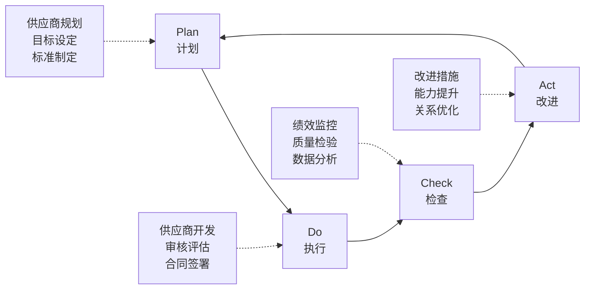

# SQM基础理论

供应商质量管理(Supplier Quality Management)核心理论体系与实践指南。

---

## 📚 SQM基本概念

### 什么是供应商质量管理？
供应商质量管理是一套系统性的管理方法，通过建立完善的供应商评估、选择、监控和改进体系，确保供应商提供的产品和服务满足企业质量要求，实现供应链质量目标。

### 核心目标
- **质量保证**：确保进料质量稳定可靠
- **成本优化**：降低质量成本与总拥有成本
- **交期达成**：保障供应链准时交付
- **持续改进**：推动供应商能力提升
- **风险控制**：识别并规避供应风险

## 🔄 SQM管理循环

### PDCA在SQM中的应用

### 管理流程五阶段

1. **供应商识别与选择**
   - 潜在供应商调研
   - 能力评估与认证
   - 商务谈判与合同签署

2. **供应商开发与导入**
   - 产品开发协作
   - 工艺验证与确认
   - 试产与批产准备

3. **日常质量管控**
   - 进料检验与控制
   - 过程监控与预警
   - 问题识别与反馈

4. **绩效评估与改进**
   - 定期绩效评估
   - 问题分析与解决
   - 持续改进推进

5. **关系维护与发展**
   - 战略合作伙伴培育
   - 技术创新协作
   - 长期关系管理

## 📊 SQM关键要素

### 质量体系要素

#### 🏗️ 体系建设
<ul>
<li>质量方针与目标</li>
<li>组织架构与职责</li>
<li>程序文件与作业指导</li>
<li>记录控制与文件管理</li>
</ul>

#### ⚙️ 过程管控
<ul>
<li>关键过程识别</li>
<li>过程控制计划</li>
<li>统计过程控制(SPC)</li>
<li>变更控制管理</li>
</ul>

#### 🔧 技术能力
<ul>
<li>产品开发能力</li>
<li>工艺设计能力</li>
<li>检测试验能力</li>
<li>问题解决能力</li>
</ul>

#### 📈 绩效管理
<ul>
<li>KPI指标体系</li>
<li>数据收集分析</li>
<li>绩效评估机制</li>
<li>改进激励措施</li>
</ul>

## 🎯 质量工具与方法

### 七大质量工具(QC 7 Tools)

1. **检查表(Check Sheet)**
   - 数据收集标准化
   - 问题分布可视化
   - 趋势变化跟踪

2. **直方图(Histogram)**
   - 数据分布展示
   - 过程能力评估
   - 异常模式识别

3. **帕累托图(Pareto Chart)**
   - 主要问题识别
   - 80/20法则应用
   - 改进优先级排序

4. **因果图(Fishbone Diagram)**
   - 根本原因分析
   - 系统性思维训练
   - 团队协作工具

5. **散布图(Scatter Diagram)**
   - 相关性分析
   - 因果关系验证
   - 回归分析基础

6. **控制图(Control Chart)**
   - 过程稳定性监控
   - 特殊原因识别
   - 预防性质量控制

7. **分层法(Stratification)**
   - 数据分类分析
   - 差异原因识别
   - 针对性改进方案

### 现代质量管理工具

#### 统计工具
- **SPC (Statistical Process Control)**：统计过程控制
- **DOE (Design of Experiments)**：实验设计
- **MSA (Measurement System Analysis)**：测量系统分析
- **PPAP (Production Part Approval Process)**：生产件批准程序

#### 管理工具
- **FMEA (Failure Mode and Effects Analysis)**：失效模式与影响分析
- **8D (8 Disciplines)**：8步法问题解决
- **5Why分析**：根本原因追踪法
- **PDCA循环**：持续改进方法论

## 🏆 质量成熟度模型

### 五级成熟度定义

| 级别 | 名称 | 特征描述 | 关键活动 |
|------|------|----------|----------|
| **Level 1** | 初始级 | 质量管理随意性大，依赖个人经验 | 建立基本质量意识 |
| **Level 2** | 可重复级 | 建立基本质量流程，但执行不稳定 | 标准化基本流程 |
| **Level 3** | 已定义级 | 质量体系文档化，流程标准化 | 体系化管理导入 |
| **Level 4** | 已管理级 | 基于数据的质量管理，量化控制 | 统计质量控制 |
| **Level 5** | 优化级 | 持续改进，预防性质量管理 | 卓越质量追求 |

### 成熟度提升路径

1. **评估现状**：使用成熟度评估工具
2. **制定计划**：分阶段提升策略
3. **能力建设**：团队培训与技能提升
4. **工具导入**：质量工具系统应用
5. **文化变革**：质量文化深度融入

## 💡 最佳实践原则

### 供应商关系管理
- **伙伴关系**：从买卖关系转向合作伙伴
- **共同发展**：与供应商共同成长
- **透明沟通**：建立开放的沟通机制
- **长期承诺**：建立稳定的合作关系

### 预防性质量管理
- **设计质量**：从源头保证质量
- **过程质量**：过程控制比检验更重要
- **全员质量**：质量是全员的责任
- **持续改进**：永不停息的质量追求

### 数据驱动决策
- **事实管理**：用数据说话
- **统计思维**：理解变异性
- **风险管理**：预测与预防
- **系统优化**：整体最优化思维

## 📖 延伸阅读

### 经典质量管理书籍
- 《质量管理体系要求》- ISO 9001:2015
- 《朱兰质量管理手册》- 约瑟夫·朱兰
- 《戴明管理法》- 爱德华·戴明
- 《六西格玛管理》- 杰克·韦尔奇

### 专业标准参考
- **ISO 9001:2015**：质量管理体系要求
- **IATF 16949:2016**：汽车质量管理体系
- **AS9100D**：航空航天质量管理体系
- **ISO 13485:2016**：医疗器械质量管理体系

---

## 🎓 学习检验

### 自测题目
1. SQM管理循环的四个阶段是什么？
2. 七大质量工具中，哪个工具最适合进行根本原因分析？
3. 质量成熟度模型的最高级别有什么特征？
4. 预防性质量管理的核心理念是什么？

### 实践作业
1. 分析你所在企业的SQM现状，评估质量成熟度等级
2. 选择一个质量问题，使用鱼骨图进行根本原因分析
3. 设计一个供应商绩效评价指标体系

---

*理论是实践的基础，实践是理论的检验。在SQM的道路上，持续学习与实践才能不断进步！*